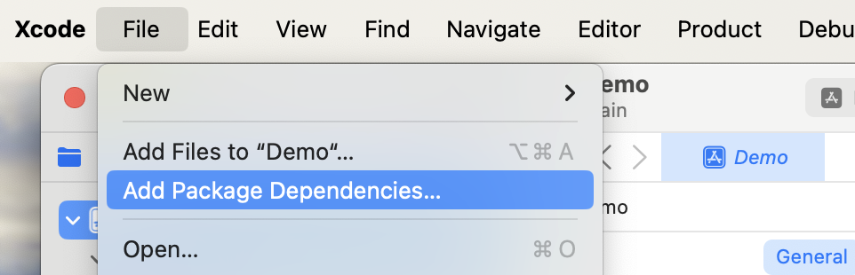
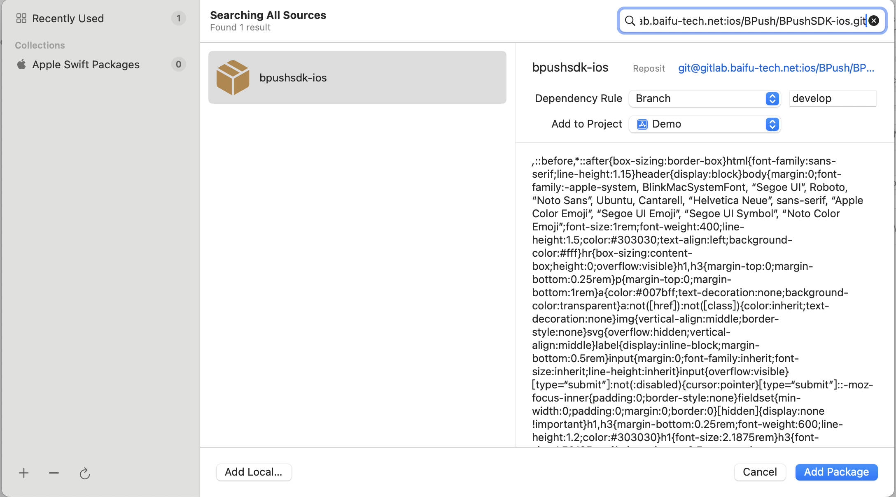
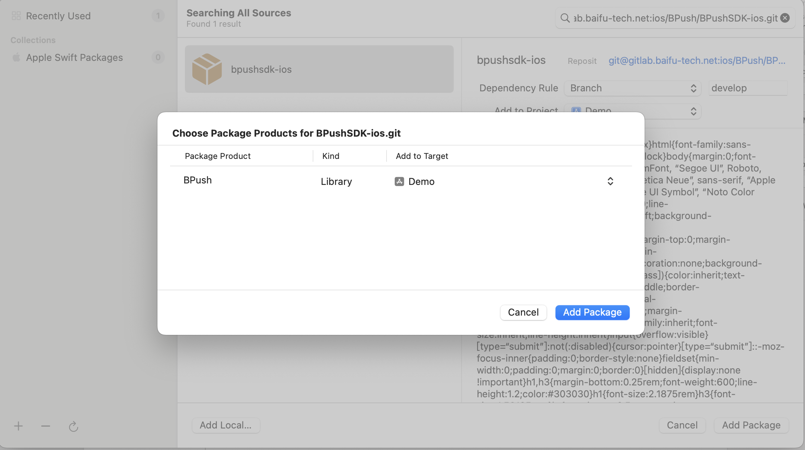
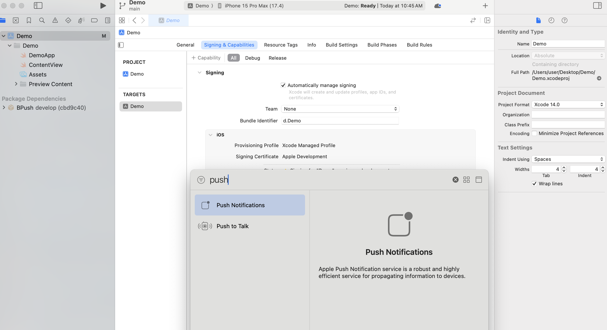

# BPush
## 導入 SDK
### 安裝
#### CocoaPods
* 使用以下命令安裝 CocoaPods
```
$ gem install cocoapods
```
* 在 Podfile 中指定 BPush
```swift
target '<Your Target Name>' do
    pod 'BPushSDK-ios'
end
```
* 執行以下命令：
```
$ pod install
```

#### Swift Package Manager

* 點選 File > Add Package Dependencies。



* 複製 git@gitlab.baifu-tech.net:ios/BPush/BPushSDK-ios.git，將它輸入在 Search or Enter Package URL 的框框裡，選擇 SDK 後點選 Add Package。



* 勾選它後點選 Add Package，將套件加到專案裡。




### 初始化

#### 將 target 加入 Push Notification 功能



#### 在 AppDelegate 中 import
```swift
 import BPush
```
#### 在 didFinishLaunchingWithOptions 中呼叫 register 並傳入 AppKey
```swift
 func application(_ application: UIApplication, didFinishLaunchingWithOptions launchOptions: [UIApplication.LaunchOptionsKey : Any]? = nil) -> Bool {
    BPush.register(appKey: "Your AppKey") 
    return true
 }
```
#### 在 didRegisterForRemoteNotificationsWithDeviceToken 中呼叫 handleDeviceToken 並傳入 deviceToken
```
func application(_ application: UIApplication, didRegisterForRemoteNotificationsWithDeviceToken deviceToken: Data) {
    BPush.handleDeviceToken(deviceToken)
}
```

### 錯誤偵測
#### 判斷 Token 接收不到的錯誤資訊
```
func application(_ application: UIApplication, didFailToRegisterForRemoteNotificationsWithError error: Error) {
    // error 顯示錯誤原因
}
```


